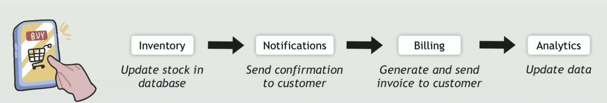
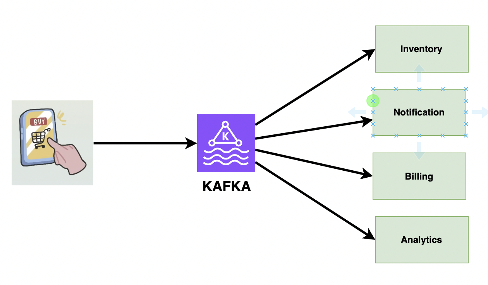

# Kafka-Explanation

This repository will explain to us about Kafka.

References: 
- [Kafka Tutorial for Beginners | Everything you need to get started](https://youtu.be/QkdkLdMBuL0?si=EaU-il8abaLJU7o8)
- [Kafka Crash Course - Hands-On Project](https://youtu.be/B7CwU_tNYIE?si=e1meReLKzo913Fva)

## Why do we need Kafka?

### Scenario 1 (Without Kafka)

Suppose we have the shopping service, where customer places an order, and once it is placed, it is going to generate the series of event, like updating the stock, sending notification, generating bill, and update in analytics.

But, in some scenrio, if like notification service failed, then our whole application will be stopped, as it is tightly coupled.

### Scenario 2 (With Kafka)

Now, we introduced a layer in between order and other services, so when a customer makes an order we just need to inform kafka, and any service can pick that info from kafka based on their requirement. We don't need to wait for them to respond, it will be responsibility of kafka to send it consumers (i.e. Inventory, Notifications, etc.). The main service just perform the fire and forget model, they just need to send it to kafka.

## Important Terms in Kafka

### Event

Whenever we need to send/recieve some information to/from kafka that is known as event. It is often known as record or message. An event consist of key, value, Timestamp, and Metadata (Optional).

### Producers

Producers are the entities which are responsible for sending events to kafka. Like, in above scenario, it was order service.

### Topics

